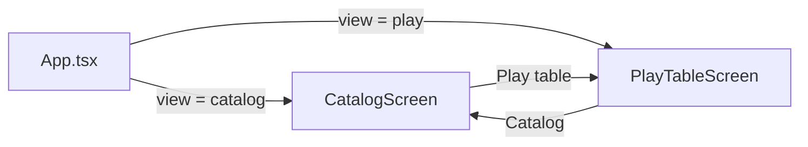

# 01 — Overview

## Purpose

**Piecepack Playground** is a desktop-oriented reference and playground for the standard [**Piece Pack**](https://piecepack.org/piecepack_article.html) game system. It helps developers and designers who build piecepack-based games or tools by providing:

1. **Catalog** — Browse every tile, coin, die, and pawn in the standard set; filter by kind, suit, and rank; inspect faces in detail.
2. **Play table** — Manipulate a full physical-style layout: drag pieces, flip faces, stack tiles/coins, shuffle stacks, roll dice.
3. **Manifest export** — Download a versioned JSON description of the complete standard set for other programs (engines, print pipelines, test fixtures).

The app is **not** a game engine. It does not implement rules for any specific piecepack game. It models the **components** and their visual representation faithfully enough to support exploration and tooling.

## Standard set (domain summary)

The Piece Pack defines four **suits** and six **ranks** (values). From those, the standard set contains:

| Kind | Count | Notes |
|------|------:|-------|
| Tiles | 24 | One per (suit × rank); obverse + reverse faces |
| Coins | 24 | One per (suit × rank); value face + suit face |
| Dice | 4 | One per suit; six faces each (∅, A, 2–5) |
| Pawns | 4 | One per suit |

Canonical strings for suits and ranks live in `src/domain/piecepack.ts` (`SUITS`, `RANKS`). All UI labels, catalog IDs, and manifest records derive from those constants — do not hard-code parallel enums elsewhere.

## Two user-facing modes

Navigation is a simple React `useState` view switch in `App.tsx`. There is no router library; deep linking between views is not implemented.

## Design principles (implicit in the codebase)

- **Domain first** — Piece Pack rules and IDs live in `src/domain/`. UI components consume types and builders from there.
- **Pure table logic** — Play-table geometry, drag, and stack-merge rules are testable functions in `playTable.ts`, separate from React event wiring.
- **Original artwork** — SVG components in `src/components/pieces/` are minimal originals (see README). They are not traced from commercial piecepack art sets.
- **Thin native shell** — [Tauri 2](https://v2.tauri.app/) wraps the Vite/React bundle for desktop distribution. No custom Rust commands yet; the frontend runs the same in `npm run dev` (browser) and `npm run tauri dev` (window).

## What is out of scope (today)

- Multiplayer, networking, or saved table layouts
- Implementing specific board games or rule enforcement
- Importing manifests back into the play table
- Pawns on the play table (catalog only)
- Automated test suite in-repo (manual verification via dev server)

When adding features, decide whether they belong in **catalog reference**, **play table simulation**, or **manifest/tooling** — keeping those concerns separated has kept the codebase small and navigable.
