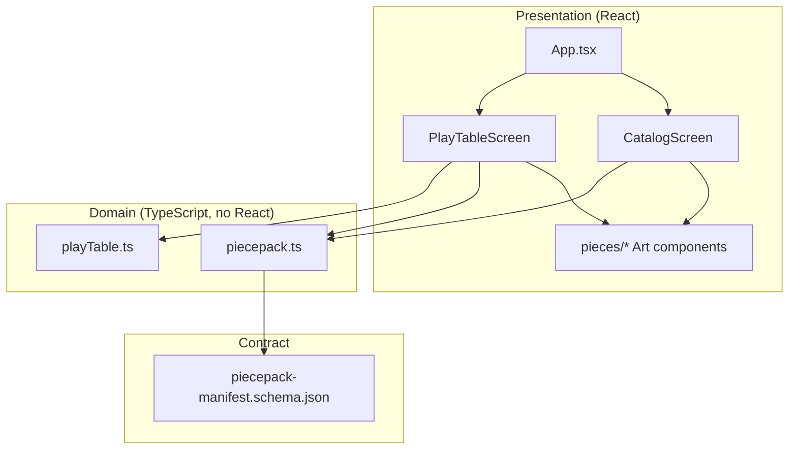

# 02 — Architecture

## Technology stack

| Layer | Choice | Role |
|-------|--------|------|
| UI | React 19 + TypeScript | Screens, local state, pointer interactions |
| Build | Vite 7 | Dev server, HMR, production bundle to `dist/` |
| SVG | `vite-plugin-svgr` | Import suit glyph SVGs as React components |
| Desktop | Tauri 2 (Rust) | Native window, bundles `dist/` — see `src-tauri/` |
| Styling | Plain CSS + CSS variables | `src/styles/tokens.css`, `src/App.css` |

There is no global state library, CSS-in-JS, or UI kit. State is component-local `useState` / `useMemo` / `useCallback`.

## Repository layout

```
piecepack-playground/
├── src/
│   ├── domain/           # Piece Pack model + play-table physics
│   ├── components/       # Screens and piece SVG art
│   ├── assets/pieces/    # Suit glyph source SVGs
│   └── styles/           # Design tokens
├── schemas/              # JSON Schema for manifest export
├── src-tauri/            # Tauri shell (minimal)
├── docs/                 # This documentation set
└── public/               # Static assets for Vite
```

## Layered architecture



### Domain layer (`src/domain/`)

- **`piecepack.ts`** — Suits, ranks, stable catalog IDs (`tile:suns:ace`, etc.), `buildCatalog()`, `buildFullManifest()`, browser download helper.
- **`playTable.ts`** — Play-area dimensions, `TableModel`, drag/move/merge helpers, `initialTable()` layout.

Domain modules must not import React or browser-only APIs except where already encapsulated (e.g. `downloadManifestJson` in `piecepack.ts`).

### Presentation layer (`src/components/`)

- **Screens** — `CatalogScreen`, `PlayTableScreen` own UX and wire events to domain functions.
- **Shared** — `PieceThumbnail`, `DetailPanel` for catalog.
- **`pieces/`** — Presentational SVG: `TileArt`, `CoinArt`, `DieArt`, `DieFaceArt`, `PawnArt`, `SuitGlyph`, `RankFace`, `suitColors.ts`.

### Native shell (`src-tauri/`)

`lib.rs` runs the default Tauri builder with no registered commands. The frontend does not call `@tauri-apps/api` yet — the dependency is present for future file dialogs, etc.

`tauri.conf.json` wires:

- Dev: `npm run dev` on port **1420** (strict; see `vite.config.ts`)
- Build: `npm run build` → `dist/` → bundled into the desktop app

## Runtime data flow

### Catalog path

1. `buildCatalog()` runs once (memoized) → flat list of `CatalogEntry` with display labels.
2. Filters derive `filtered` via `useMemo`.
3. Selection drives `DetailPanel` and grid highlighting.
4. Export calls `buildFullManifest()` → `downloadManifestJson()` (Blob + temporary `<a download>`).

### Play table path

1. `initialTable()` creates loose tiles/coins, empty stacks, four dice with random faces.
2. Pointer down → `DragState` (kind, id, grab offset).
3. `pointermove` → `moveDraggedPiece(model, drag, px, py)` updates positions with clamping.
4. `pointerup` → `mergeOnDrop(...)` may fuse stacks if drop point is within `MERGE_DIST` of another piece center.
5. Toolbar actions (flip, shuffle, pick top, roll) mutate `TableModel` in screen-local handlers.

Play-table **instance IDs** (`pp-…` from `uid()`) are unrelated to catalog/manifest IDs (`tile:suns:ace`). The table tracks *physical instances*; the catalog tracks *canonical piece types*.

## Development workflows

| Command | Use when |
|---------|----------|
| `npm run dev` | Fast UI work in the browser; no Rust toolchain required |
| `npm run tauri dev` | Verify window chrome, Tauri integration, production-like loading |
| `npm run build` | Typecheck (`tsc`) + Vite production bundle |
| `npm run tauri build` | Desktop installers (needs platform deps) |

For most UI and domain changes, **`npm run dev`** is sufficient.

## Extension points (architectural)

| Need | Likely location |
|------|-----------------|
| New piece kind or rank | `piecepack.ts` + schema + art components + catalog/play UI |
| Persisted layouts | New domain module + Tauri fs/dialog or `localStorage` |
| Validate export | CI step: validate `buildFullManifest()` against `schemas/` |
| Game rules prototype | New screen or module; avoid coupling into `piecepack.ts` |
| Native features | `src-tauri/src/lib.rs` commands + `@tauri-apps/api` from React |

See [07-contributing.md](./07-contributing.md) for concrete edit checklists.
