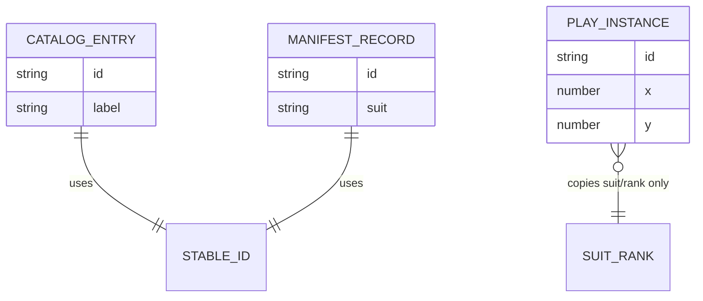

# 03 — Domain model

All Piece Pack semantics are centralized in `src/domain/piecepack.ts`. Play-table physics and layout are in `src/domain/playTable.ts`. This document explains the **three related but distinct** representations of “pieces” in the app.

## Vocabulary

### Suits and ranks

```ts
SUITS = ["suns", "moons", "crowns", "arms"]
RANKS = ["null", "ace", "2", "3", "4", "5"]
```

- **`null`** — The “empty” or zero face on dice and tiles; displayed as ∅ in short form.
- **`ace`** — Rank A, not the playing-card name “Ace” in rules text (labels use `rankLabel()`).

Helper functions: `suitLabel`, `rankLabel`, `rankShort` — use these for UI instead of ad hoc capitalization.

### Piece kinds

`PieceKind = "tile" | "coin" | "die" | "pawn"`

Dice use **`DIE_FACES`** — the canonical face order for manifests and anatomy diagrams: same as `RANKS` (∅ through 5).

## Stable catalog IDs

IDs identify **which standard piece** something is, not a unique physical instance on the table.

| Kind | Pattern | Example |
|------|---------|---------|
| Tile | `tile:{suit}:{rank}` | `tile:crowns:3` |
| Coin | `coin:{suit}:{rank}` | `coin:arms:null` |
| Die | `die:{suit}` | `die:moons` |
| Pawn | `pawn:{suit}` | `pawn:suns` |

Builders: `tileId()`, `coinId()`, `dieId()`, `pawnId()`.

These patterns are **enforced** in `schemas/piecepack-manifest.schema.json` via regex on the `id` field.

## Representation 1: Catalog entries

**Purpose:** UI browse/filter with human-readable labels.

```ts
type CatalogEntry = TileEntry | CoinEntry | DieEntry | PawnEntry
// Each includes: kind, id, suit, label, (+ rank or faces as needed)
```

- Built by `buildCatalog()` — 24 + 24 + 4 + 4 = **56 entries**.
- `label` is derived (e.g. `"Crowns tile — 3"`).
- Used by `CatalogScreen`, `PieceThumbnail`, `DetailPanel`.

Catalog entries are **immutable templates**. Selecting one in the grid does not create play-table state.

## Representation 2: Manifest records

**Purpose:** Machine-readable export for downstream tools.

```ts
type PiecePackManifest = {
  manifestVersion: "1.0.0";
  spec: "https://piecepack.org/piecepack_article.html";
  generatedAt: string; // ISO-8601
  tiles: TileRecord[];
  coins: CoinRecord[];
  dice: DieRecord[];
  pawns: PawnRecord[];
}
```

- Built by `buildFullManifest(now?)`.
- Records are slimmer than catalog entries (no `label` field).
- Dice include `faces: Rank[]` (copy of `DIE_FACES` per die).
- Version and spec URL are fixed constants (`MANIFEST_VERSION`, `SPEC_URL`).

When changing the domain model, update **both** TypeScript types and `schemas/piecepack-manifest.schema.json`, and bump `manifestVersion` if the contract breaks compatibility.

## Representation 3: Play table model

**Purpose:** Simulated physical layout — position, orientation, stacks.

```ts
type FaceCard = { suit: Suit; rank: Rank; faceUp: boolean }

type TableModel = {
  looseTiles: LooseTile[];   // id, x, y, suit, rank, faceUp
  looseCoins: LooseCoin[];
  tileStacks: TileStack[];   // ordered tiles[]
  coinStacks: CoinStack[];
  dice: DiePiece[];          // faceIndex into DIE_FACES
}
```

- **Instance `id`** — from `uid()` (`pp-…`), unique per loose piece/stack/die on the table.
- **`faceUp`** — For tiles: obverse vs reverse. For coins: value face vs suit face.
- **Stacks** — Ordered arrays; top = last element. Merge rules in `mergeOnDrop()`.

There is **no** pawn type on the table today. Adding pawns would extend `TableModel`, `initialTable()`, render loop in `PlayTableScreen`, and drag kinds.

## Relationship diagram



## Key domain functions (quick reference)

| Function | Module | Role |
|----------|--------|------|
| `buildCatalog()` | piecepack | All catalog entries |
| `buildFullManifest()` | piecepack | Export payload |
| `downloadManifestJson()` | piecepack | Trigger browser download |
| `initialTable()` | playTable | Default play layout |
| `moveDraggedPiece()` | playTable | Drag with bounds clamp |
| `mergeOnDrop()` | playTable | Stack on proximity |
| `shuffleInPlace()` | playTable | Fisher–Yates for stacks |

## Merge behavior (play table)

When a drag ends, `mergeOnDrop` compares the pointer position to **centers** of candidate targets within `MERGE_DIST` (50px). Closest wins.

- Loose tile + loose tile → new `tileStack` at target position.
- Loose/stack tile dropped on stack → append to stack’s `tiles[]`.
- Same pattern for coins (`looseCoins` / `coinStacks`).
- Dice do not stack with each other in the current rules.

Stack-on-stack merges concatenate arrays and may collapse to a single new stack id (`uid()`).

Understanding this helps when debugging “why didn’t my pieces stack?” — check distance in play-area coordinates and that kinds match (tiles only merge with tiles, etc.).
