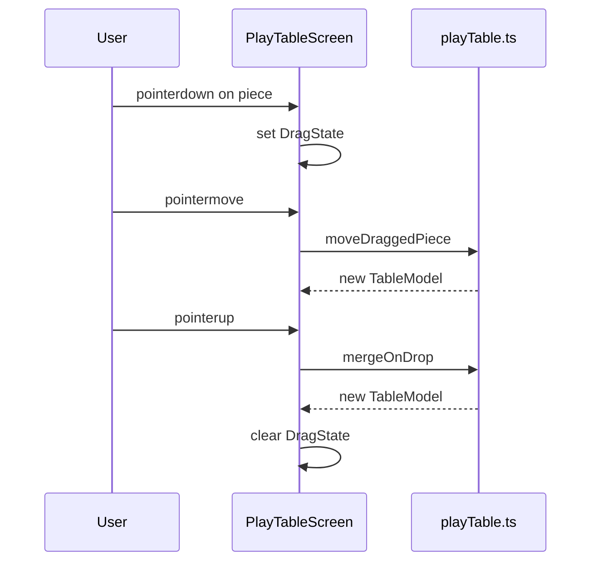

# 04 — UI and screens

## Application shell

`App.tsx` holds `view: "catalog" | "play"` and renders exactly one screen. Shared chrome patterns:

- **Header** — Title, subtitle, primary navigation button
- **Footer** — Link to official spec, short tech label

Global styles: `src/App.css` (layout, grids, play surface). Color tokens: `src/styles/tokens.css` imported from `main.tsx`.

## Catalog screen

**File:** `src/components/CatalogScreen.tsx`

### Responsibilities

| Area | Behavior |
|------|----------|
| Filters | Search string; chips for kind, suit, rank |
| Grid | `piece-grid` of selectable cards with thumbnails |
| Detail | `DetailPanel` slide-aside for selected entry |
| Export | “Export manifest JSON” → `buildFullManifest()` + download |

### Filter rules

- **Rank filter** disabled when kind is die or pawn (they have no single rank).
- Search matches `id`, `label`, or `suit` substring (case-insensitive).
- `filtered` recomputes via `useMemo` when any filter changes.

### Selection UX

- Click card → `setSelected(entry)`, `aria-pressed` on active card.
- Detail panel “Clear” → `onClose()` nulls selection.

### Component dependencies

```
CatalogScreen
├── PieceThumbnail → pieces/* Art
├── DetailPanel → pieces/* Art (multi-face layouts)
└── domain/piecepack (catalog, manifest, labels)
```

## Play table screen

**File:** `src/components/PlayTableScreen.tsx`

### Responsibilities

| Area | Behavior |
|------|----------|
| Surface | Fixed `PLAY_W` × `PLAY_H` (1000×560) play area |
| Drag | Pointer capture via window `pointermove` / `pointerup` |
| Stacks | Visual offset per card; count badge |
| Toolbar | Reset, Flip, Shuffle stack, Pick top, Roll die |

### Interaction model



- **Selection** — `selected: { kind, id }` for toolbar actions; cleared when clicking empty table (if not dragging).
- **Double-click** — Flips top face of loose tile/coin or top of stack (stack: only top card receives flip).
- **Z-index** — Dragged piece gets `zIndex: 50` during drag.

### Face rendering wrappers

Local helpers map `FaceCard` → art:

- `TileFace` — `TileArt` with `obverse` / `reverse` from `faceUp`
- `CoinFace` — `CoinArt` with `value` / `suit` face from `faceUp`
- Dice — `DieFaceArt` with rank from `DIE_FACES[faceIndex]`

Play table uses **play-specific** CSS variables (`--play-piece-face`, etc.) where the catalog uses catalog tokens (`--tile-face`).

### Toolbar availability

| Action | When enabled |
|--------|----------------|
| Flip | Any selected piece/stack |
| Shuffle stack | Selected `tileStack` or `coinStack` |
| Pick top | Selected stack — pops top to loose piece(s) |
| Roll die | Selected `die` |

`pickTop` logic splits stacks of size 1–2 into loose pieces; larger stacks keep a shortened stack.

## Shared components

### `PieceThumbnail`

Maps `CatalogEntry.kind` to a default preview:

- Tile → obverse only
- Coin → value face
- Die → `DieArt` grid layout
- Pawn → `PawnArt`

Applies `suitCssVar(suit)` as `color` for tinted glyphs.

### `DetailPanel`

Educational / reference layouts:

- Tiles & coins — side-by-side faces with captions
- Die — strip + grid layouts via `DieArt`
- Pawn — single enlarged figure

Empty state when `entry === null`.

## Accessibility notes

- Filter sections use `<fieldset>` / `<legend>`; play toolbar has `role="toolbar"`.
- Decorative SVGs use `aria-hidden` on art; important status via `role="status"` (filter count).
- Focus styles rely on `--focus` token (keyboard users — verify when adding new controls).

## Adding a new screen

1. Create component under `src/components/`.
2. Extend `View` type and routing in `App.tsx`.
3. Add header nav button on existing screens for discoverability.
4. Reuse `app-header` / `app-footer` classes for visual consistency.
5. Document the screen in this file and [01-overview.md](./01-overview.md) if it is a primary mode.
